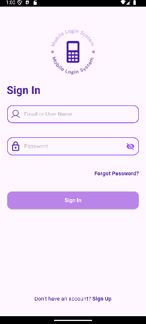
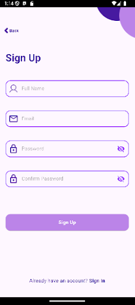
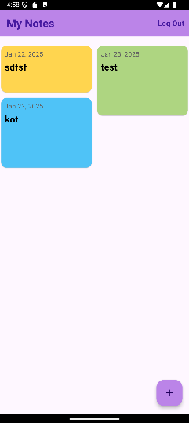

## Table of Contents :scroll:
* [Project Overview](#project-overview-rocket)
* [Features](#features-fire)
* [Technologies](#technologies-wrench)
* [Screenshots](#screenshots-desktop_computer)
* [Installation](#installation-magic_wand)
* [Credits & Resources](#credits--resources-books)

## Project Overview :rocket:
NotesApp was created as a final project for the **"Programming Mobile Applications"** course.  
It is a **Flutter-based mobile application** that allows users to **register, log in, and manage notes** associated with their accounts.  

The design for the **login and registration screens** was based on given Figma design, while the **notes screen** and database functionality were developed based on a tutorial, with some modifications.

## Features :fire:
- 🔑 **User Authentication** (Login & Register with SQLite database)
- 📝 **Create, Read, Update, Delete (CRUD) Notes** stored in a local database
- 👤 **Notes are assigned to specific users**
- 📂 **Persistent Data Storage** using `sqflite`
- 🎨 **Modern UI** based on Figma design
- 📱 **Responsive & User-Friendly Interface**


## Technologies :wrench:
#### This project was created using:
- **Flutter SDK**: `3.5.4`
- **Dart**: `3.5.4`
- **SQLite (sqflite)** for local database
- **Shared Preferences** for storing user settings
- **Flutter Staggered Grid View** for layout customization
- **Android Studio** as the development environment


## Screenshots :desktop_computer:

### Login Screen:


### Register Screen:



### Notes Screen:


## Installation :magic_wand:
1. **Clone the repository**  
   ```bash
   git clone https://github.com/Lesiiaa/Notes_Android_App.git
   ```
2. **Open the project in Android Studio**  
3. **Run the app! Use an emulator or a connected phone** 


## Credits & Resources :books:
- **Login and Registration screens designed based on given Figma deign**
- **Notes screen and database implementation based on this tutorial**:  
  📺 [Flutter Notes App with SQLite (YouTube)](https://www.youtube.com/watch?v=UpKrhZ0Hppk&t=30s)  


